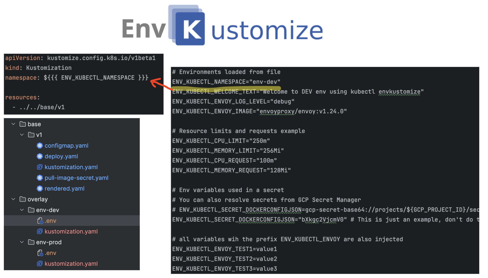

# Kubectl Plugin for Environment Variable Support in Kustomize

A `kubectl` plugin that enables the use of environment variables in Kustomize overlays.
 

## Why This Plugin?

I've used Kustomize extensively over the years, and I've always missed the ability to evaluate environment variables in overlays.
The recommended approach, using patches and overlays, is just too much work when managing a large fleet of clusters. It can be a pain, even for basic tasks like patching an image name!

This plugin is largely a response to the frustrations described here:

* [ConfigMapGenerator should not load values from the build environment](https://github.com/kubernetes-sigs/kustomize/issues/4731)
* [Reddit discussion on passing dynamic values to Kustomize](https://www.reddit.com/r/kubernetes/comments/116hze5/how_to_pass_dynamic_values_to_kustomize/)
* [ArgoCD issue on dynamic values](https://github.com/argoproj/argo-cd/issues/1705)

## How Does It Work?

The plugin is a lightweight wrapper around the official Kustomize API (krusty) [Kustomizer](https://github.com/kubernetes-sigs/kustomize/blob/master/api/krusty/kustomizer.go). It replaces the original filesystem loader with a custom one that evaluates environment variables before loading the file.

## How to Use It?

```bash
# You need to run it in a valid Kustomize overlay folder like this:
cd /examples/overlay/env-dev
kubectl envkustomize render
# Check the rendered.yaml file generated in the same folder
```

## Installation

* Homebrew

```bash
brew tap felixgborrego/kubectl-envkustomize https://github.com/felixgborrego/kubectl-envkustomize
brew install kubectl-envkustomize
```

* Manually (Linux) / CI/CD

```bash
      - name: Install kubectl-envkustomize
        run: |
          curl -L "https://github.com/felixgborrego/kubectl-envkustomize/releases/download/v0.0.1/kubectl-envkustomize_Linux_i386.tar.gz" -o kubectl-envkustomize.tar.gz
          tar -xzf kubectl-envkustomize.tar.gz
          sudo mv kubectl-envkustomize /usr/local/bin/
```


### Evaluations Supported

* Basic environment variables replacement: `${{{ VAR }}}`
* Load of environment variables from `.env` files or from the environment itself (using a prefix to avoid loading all environment variables and to avoid conflicts)
* Load secrets from GCP Secret Manager (Welcome PRs to add AWS Secrets Manager and Azure Key Vault support)
* Expand environment with `${{{env-expand://ENV_}}}` to inject automatically all environment variables starting with `ENV_`
* Support for environment variables substitution even inside helm charts (or other external resources as long as they are referenced in the kustomize overlay)